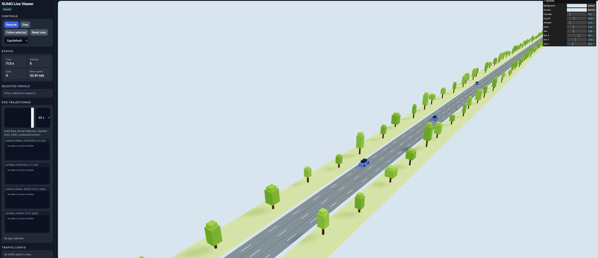

# SUMO Live Traffic Visualizer

This repository contains a Python-based SUMO / TraCI simulation runner with a lightweight live HTML visualizer. The script starts a SUMO simulation, advances it step by step, reads vehicle, traffic-light, and network states through TraCI, and serves the current simulation state through a local HTTP API.

All vehicles are controlled by SUMO’s native car-following and lane-changing models. The code does not apply any external vehicle controller, speed override, acceleration command, or sublane-control command.



## Overview

The tool is intended as a simple visualization and debugging layer for SUMO simulations. It provides:

- live vehicle positions, speeds, headings, lanes, and vehicle types;
- traffic-light states and time-to-switch values;
- network geometry extracted from the SUMO network file;
- pause, resume, and step controls through a local HTTP endpoint;
- optional SUMO-GUI execution alongside the browser visualizer.

## Repository structure

```text
.
├── run_sumo_viewer.py          # Main SUMO runner and HTTP server
├── sim/                        # Browser visualization files
├── networks/                   # SUMO network, route, and configuration files
├── README.md
└── .gitignore
```

## Requirements

- Python 3.9+
- SUMO installed locally
- `SUMO_HOME` environment variable set
- Python packages:
  - `numpy`
  - `lxml`
  - `sumolib`
  - `traci`

`sumolib` and `traci` are usually available through the SUMO tools directory when `SUMO_HOME` is set correctly.

## Setting `SUMO_HOME`

On macOS, this may look like:

```bash
export SUMO_HOME="/opt/homebrew/opt/sumo/share/sumo"
```

or:

```bash
export SUMO_HOME="/Applications/SUMO/share/sumo"
```

Add the correct line to your shell profile, for example `~/.zshrc`, if you want it to persist.

Check that it is set:

```bash
echo $SUMO_HOME
```

## Running the simulation

Run with the default SUMO configuration:

```bash
python run_sumo_viewer.py
```

Run with a specific SUMO config file:

```bash
python run_sumo_viewer.py --sumo-cfg networks/highway/highway.sumocfg
```

Run with SUMO-GUI enabled:

```bash
python run_sumo_viewer.py --sumo-gui
```

Set simulation duration and step length:

```bash
python run_sumo_viewer.py --sim-time 600 --step-length 0.1
```

After starting the script, open the browser visualizer at:

```text
http://127.0.0.1:8000
```

## API endpoints

The local server exposes:

```text
GET /api/state
```

Returns the current simulation snapshot, including vehicles, traffic lights, network geometry, statistics, and metadata.

```text
GET /api/health
```

Returns basic server health and simulation metadata.

```text
POST /api/control
```

Supports simple control actions:

```json
{"action": "pause"}
```

```json
{"action": "resume"}
```

```json
{"action": "toggle"}
```

```json
{"action": "step"}
```

## SUMO-only control policy

This repository is configured so that all vehicles remain under SUMO control. The Python code only reads simulation state and optionally colors vehicles for visualization.

The script does not call:

- `vehicle.setSpeed`
- `vehicle.changeSublane`
- `vehicle.setLaneChangeMode`
- external MPC / CSAC / DDP controllers

This makes the simulation useful as a clean SUMO-controlled baseline.

## Notes

- Generated SUMO output files are excluded from version control through `.gitignore`.
- The visualizer is intended for debugging and research visualization, not as a production web application.
- External controllers should be documented separately if they are added later.